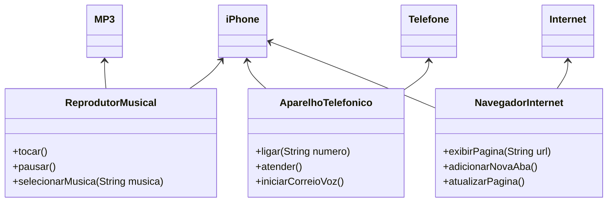

# Desafio de criação de UML da Trilha Java Básico DIO
Um desafio proposto pelo curso da Santander de Java na plataforma DIO para praticar conceitos de orientação a objetos, abaixo está o gráfico que representa as heranças e representações gráficas de todos os métodos:

