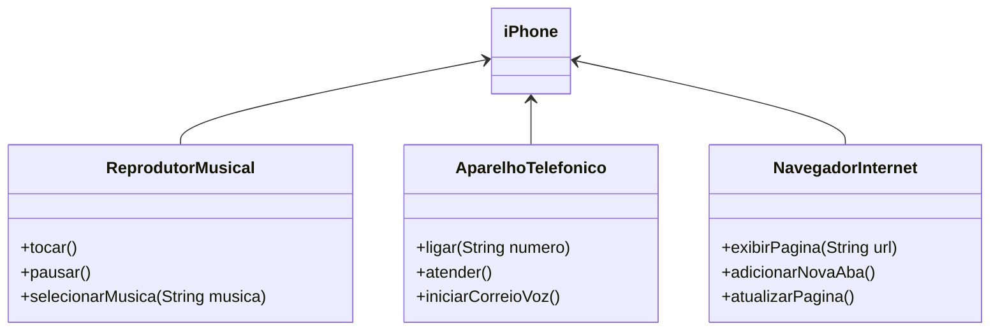

# desafio_uml_java_dio
Um desafio proposto pelo curso da Santander de Java na plataforma DIO

```mermaid
classDiagram
    class ReprodutorMusical {
        +tocar()
        +pausar()
        +selecionarMusica(String musica)
    }

    class AparelhoTelefonico {
        +ligar(String numero)
        +atender()
        +iniciarCorreioVoz()
    }

    class NavegadorInternet {
        +exibirPagina(String url)
        +adicionarNovaAba()
        +atualizarPagina()
    }

    class iPhone {
    }

    iPhone <-- ReprodutorMusical
    iPhone <-- AparelhoTelefonico
    iPhone <-- NavegadorInternet
```
